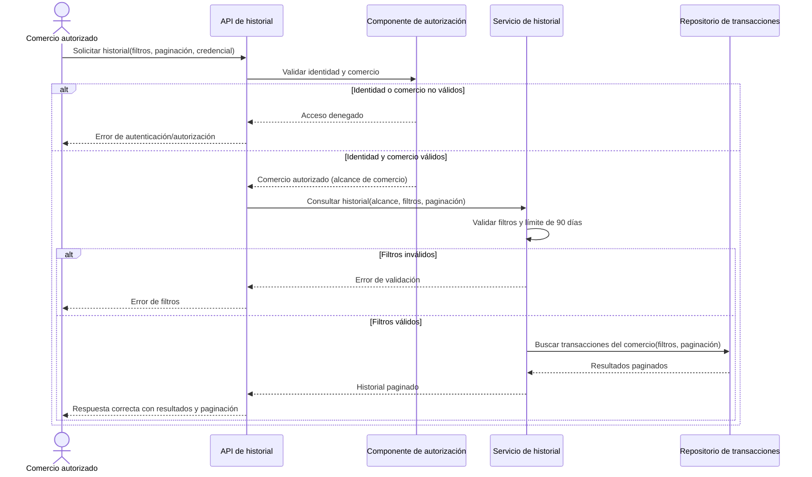

# Secuencia — consulta de historial de transacciones

```mermaid
sequenceDiagram
    actor Comercio as Comercio autorizado
    participant API as API de historial
    participant Autorizacion as Componente de autorización
    participant Servicio as Servicio de historial
    participant Repositorio as Repositorio de transacciones

    Comercio->>API: Solicitar historial(filtros, paginación, credencial)
    API->>Autorizacion: Validar identidad y comercio

    alt Identidad o comercio no válidos
        Autorizacion-->>API: Acceso denegado
        API-->>Comercio: Error de autenticación/autorización
    else Identidad y comercio válidos
        Autorizacion-->>API: Comercio autorizado (alcance de comercio)
        API->>Servicio: Consultar historial(alcance, filtros, paginación)
        Servicio->>Servicio: Validar filtros y límite de 90 días

        alt Filtros inválidos
            Servicio-->>API: Error de validación
            API-->>Comercio: Error de filtros
        else Filtros válidos
            Servicio->>Repositorio: Buscar transacciones del comercio(filtros, paginación)
            Repositorio-->>Servicio: Resultados paginados
            Servicio-->>API: Historial paginado
            API-->>Comercio: Respuesta correcta con resultados y paginación
        end
    end
```
